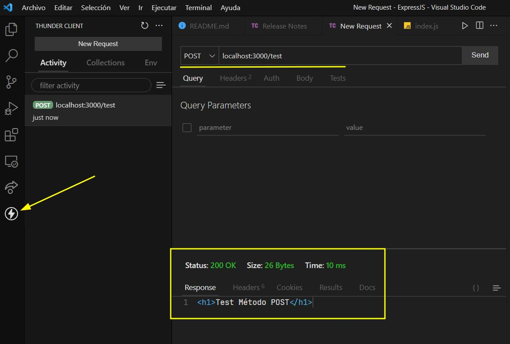

# **[Express JS](http://expressjs.com/en/4x/api.html)**
Express es un framework para Node JS para crear aplicaciones del lado del servidor.

## **SET UP Servidor Básico con Node JS**

1. Crear un directorio para el Proyecto
2. Crear archivo index.js:

   ```js
    const http = require('http');

    const server = http.createServer((req,res)=>{
       res.status = 200;
       res.setHeader('Content-type','text/plain');
       res.end('Hello world from pure Node JS server')
    });

    server.listen(3000,() => { 
       console.log('Server on port: 3000')
    })
   ```
3. Ejecutar:  ``` node index.js```
4. Acceder desde el navegador: ```localhost:3000```

> La desventaja es que debemos ir complementando toda la lógica del servidor. Se vuelve una tarea mas compleja. <br> Como alternativa se utilizan los frameworks, donde uno de los mas populares es Express

<br> <br>

## **SET UP Servidor con Express**

1. Inicializar proyecto(package.json): ```npm init -y```
2. Instalar express: ```npm install express```
3. Desde el index.js:
   ```js
   const express = require('express');
   const app = express();

   // Si hay una petición get a la raiz del proyecto
   app.get('/',(req,res) => {  
       res.send('Hello world');
   })

   app.listen(3000,() => {  
       console.log('Server on port 3000');
   })
   ```
4. Ejecutar: ```node index.js```
5. Acceder desde el navegador: ```localhost:3000```

> **Nota:** Por cada cambio se debe detener el servidor con Ctrl+c y volver a ejecutarlo.

---
## **Refrescar cambios en el servidor sin reiniciar manualmente**

### [**Nodemon**](https://nodemon.io/)
El módulo estará pendiente a los cambios de Javascript y reiniciará el servidor automáticamente.
En lugar de correr el servidor con ```node index.js```:

1. Instalar: ```npm install -D nodemon```
2. Ejecutar: ```npx nodemon index.js```

---

<br>

## **Routing (url's)**

**GET,POST,PUT y DELETE**

Si agregamos el siguiente código al servidor:
```js
app.get('/test',(req,res) => {  
    res.send('<h1>Test Método GET</h1>');
})

app.post('/test',(req,res) => {  
    res.send('<h1>Test Método POST</h1>');
})

app.put('/test',(req,res) => {  
    res.send('<h1>Test Método PUT</h1>');
})

app.delete('/test',(req,res) => {  
    res.send('<h1>Test Método DELETE</h1>');
})
```
Si accedemos en el navegador a ```localhost:3000/test```, lo que retorna es el texto **'Test Método GET'**

### **Para probar el resto de métodos:**

> Se pueden realizar las peticiones mediante JS.

> En este caso se puede utilizar un programa para realizar peticiones sobre API's como lo es **POSTMAN**

Instalar postman o bien instalar la extensión de VSCODE llamada ```Thunder client```.

<br>

**Se coloca el tipo de petición y la ruta a la cual va dirigida:**

