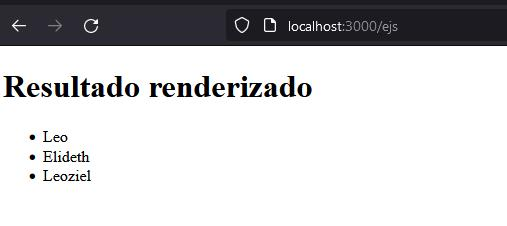

# **[Express JS](http://expressjs.com/en/4x/api.html)**
Express es un framework para Node JS para crear aplicaciones del lado del servidor.

## **SET UP Servidor Básico con Node JS**

1. Crear un directorio para el Proyecto
2. Crear archivo index.js:

   ```js
    const http = require('http');

    const server = http.createServer((req,res)=>{
       res.status = 200;
       res.setHeader('Content-type','text/plain');
       res.end('Hello world from pure Node JS server')
    });

    server.listen(3000,() => { 
       console.log('Server on port: 3000')
    })
   ```
3. Ejecutar:  ``` node index.js```
4. Acceder desde el navegador: ```localhost:3000```

> La desventaja es que debemos ir complementando toda la lógica del servidor. Se vuelve una tarea mas compleja. <br> Como alternativa se utilizan los frameworks, donde uno de los mas populares es Express

<br> <br>

## **SET UP Servidor con Express**

1. Inicializar proyecto(package.json): ```npm init -y```
2. Instalar express: ```npm install express```
3. Desde el index.js:
   ```js
   const express = require('express');
   const app = express();

   // Si hay una petición get a la raiz del proyecto
   app.get('/',(req,res) => {  
       res.send('Hello world');
   })

   app.listen(3000,() => {  
       console.log('Server on port 3000');
   })
   ```
4. Ejecutar: ```node index.js```
5. Acceder desde el navegador: ```localhost:3000```

> **Nota:** Por cada cambio se debe detener el servidor con Ctrl+c y volver a ejecutarlo.

---
## **Refrescar cambios en el servidor sin reiniciar manualmente**

### [**Nodemon**](https://nodemon.io/)
El módulo estará pendiente a los cambios de Javascript y reiniciará el servidor automáticamente.
En lugar de correr el servidor con ```node index.js```:

1. Instalar: ```npm install -D nodemon```
2. Ejecutar: ```npx nodemon index.js```

---

<br>

## **Routing (url's)**

**GET,POST,PUT y DELETE**

Si agregamos el siguiente código al servidor:
```js
app.get('/test',(req,res) => {  
    res.send('<h1>Test Método GET</h1>');
})

app.post('/test',(req,res) => {  
    res.send('<h1>Test Método POST</h1>');
})

app.put('/test',(req,res) => {  
    res.send('<h1>Test Método PUT</h1>');
})

app.delete('/test',(req,res) => {  
    res.send('<h1>Test Método DELETE</h1>');
})
```
Si accedemos en el navegador a ```localhost:3000/test```, lo que retorna es el texto **'Test Método GET'**

### **Para probar el resto de métodos:**

> Se pueden realizar las peticiones mediante JS.

> En este caso se puede utilizar un programa para realizar peticiones sobre API's como lo es **POSTMAN**

Instalar postman o bien instalar la extensión de VSCODE llamada ```Thunder client```.

<br>

**Se coloca el tipo de petición y la ruta a la cual va dirigida:**


---

## **Response con un JSON**
```JS
app.get('/test',(req,res) => {  
    res.json({
        username: 'Leo',
        lastname: 'Zubiri'
    });
})
```

## **Request con JSON**
```JS
app.use(express.json());

app.post('/user',(req,res) => {
    console.log(req.body);
    res.send('POST Recibido');
})
```


---

## **Routing dinámico**
Se coloca la ruta y posteriormente diagonal :variable.
Para acceder a este se usa res.params

```js
app.post('/user/:id',(req,res) => {
    console.log(req.params);
    res.send('POST Recibido');
})
```


---

## **app.all**
Hacer algo para determinadas rutas para cuando ocurra alguna petición get,post,put,delete. No importa el tipo de petición, siempre lo aplicará.

```js
app.all('/user',(req,res,next) => {
    console.log('Petición a User');
    res.send('Realizaste una petición a la ruta user');
    next();
})
```

---

## **Middlewares**

Funciones que son ejecutadas para cualquier ruta después de un request pero antes de otros middlewares hasta finalmente llegar al response. Funcionan para procesar datos antes de llegar a una ruta.

Antes de pasar a cualquier ruta pasa por el siguiente middleware.
```js
function logger(req,res,next) {
    console.log('Request recibida');
    console.log(`Request a ${req.protocol}://${req.get('host')}${req.originalUrl}`);

    next();
}

app.use(logger);
```

## [Middleware Morgan](https://www.npmjs.com/package/morgan)

Es un middleware alojado en npm con función de logger.

```npm install morgan```

```js
const morgan = require('morgan');

// Algun tipo de configuracion para el logger
app.use(morgan('dev'));
```
Con lo anterior se desplegarán con un formato en la consola todas las peticiones que llegan y los estatus de resultado de esta.

---

<br>

## **Express Static Files**

Se encarga de retornar archivos estaticos al frontend
Crear directorio, es convencional crear la carpeta "public" para archivos estáticos. Se puede crear archivos html,css y javascript


```js

// Se coloca al final de todas las rutas para que en caso de que no sea ninguna, cargue el contenido de public.
app.use(express.static('public'));
```

## **Settings**
Las configuraciones se establecen en una especie de variables:
```js

// VARIABLE, VALOR
app.set('appName','Practicando Express');
console.log(app.get('appName'));

app.set('port',3000);
app.get('port');
```

---

<br>

## **Motores de templates(plantillas)**

Express permite conectar diferentes motores de templates.
Un motor de templates es simplemente texto que es procesado y convertido en html.

Se envía un objeto con los datos llave:valor y este se renderiza en html. 
Bastante útil para crear formatos de correo con mensajes personalizados y diseños concretos.

<br>

### **EJS**

Es un motor de plantillas muy popular para Express.
Para instalar:

```npm i ejs```

Implementación:

```js
app.set('view engine','ejs');
```

1. Crear directorio **Views**
2. Crear dentro del directorio un **index.ejs**
3. Colocar contenido html pero con sintaxis agregada de EJS:

```html
<!DOCTYPE html>
<html lang="en">
<head>
    <meta charset="UTF-8">
    <meta http-equiv="X-UA-Compatible" content="IE=edge">
    <meta name="viewport" content="width=device-width, initial-scale=1.0">
    <title>Ejs Template</title>
</head>
<body>

    <h1> Resultado renderizado </h1>

    <ul>
        <% people.forEach(function (person){  %>
            <li>  <%= person.name %>  </li>
        <% }) %>
    </ul>
    
</body>
</html>
```

Lo anterior espera una entrada llamada "people"

<br>

**Renderizar el EJS a html:**
```js
app.get('/ejs', (req,res) => {
    const data = [
        {name: 'Leo', lastname: 'Zubiri'},
        {name: 'Elideth', lastname: 'Zubiri'},
        {name: 'Leoziel', lastname: 'Zubiri'}
    ]

    // Mandar la data -> "People"
    res.render('index.ejs',{people: data});
});
```

Al consultar la ruta /ejs:



### Listado de motores de plantilla:
1. [EJS](https://ejs.co/)
2. [PUG](https://pugjs.org/api/getting-started.html) 
3. [HANDLEBARS](https://handlebarsjs.com/)

---

<br>

## **DATABASE Integration**

Express es flexible con la base de datos de elección, solo se necesita instalar el [modulo de conección](https://expressjs.com/es/guide/database-integration.html) correspondiente.

Existen maneras de generalizar estos modulos por si en algún momento se necesita cambiar de bdd. Por ejemplo: sqlite a mariaDB:

### **Sequelize**
> Sequelize es un ORM para Nodejs que nos permite manipular varias bases de datos SQL de una manera bastante sencilla, entre estas bases de datos podemos encontrar: mysql, sqlite, postgres, mssql.

[Acerca de Sequelize ->](https://sequelize.org/)

---

<br> <br>

# Alternativa a Express
Desarrollar del lado del servidor con NodeJS

1. Adonis JS [Consultar->](https://adonisjs.com/)
2. SailsJS  [ Consultar ->](https://sailsjs.com/)
3. KOA JS [ Consultar ->](https://koajs.com/#application)
4. HapiJS [Consultar ->](https://hapi.dev/)
5. KrakenJS [Consultar -> ](https://krakenjs.com/)